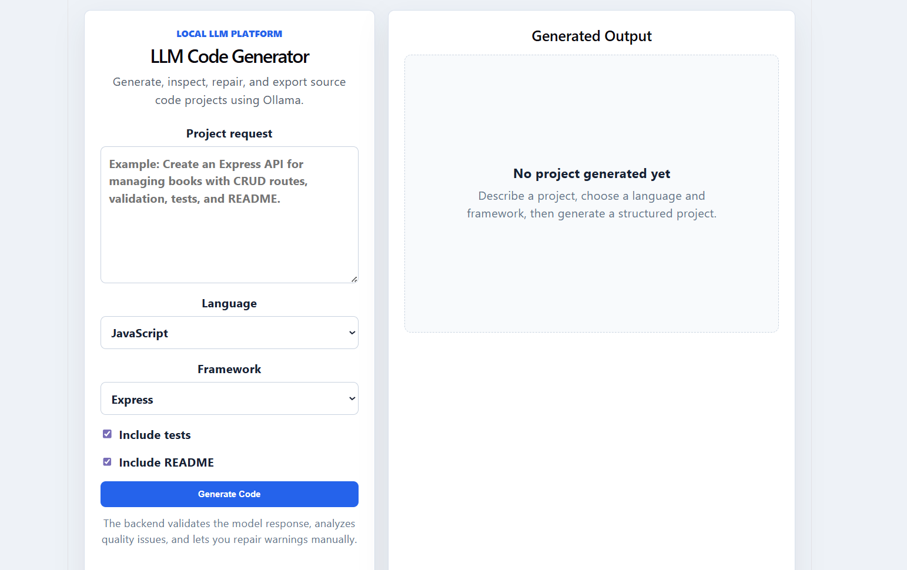
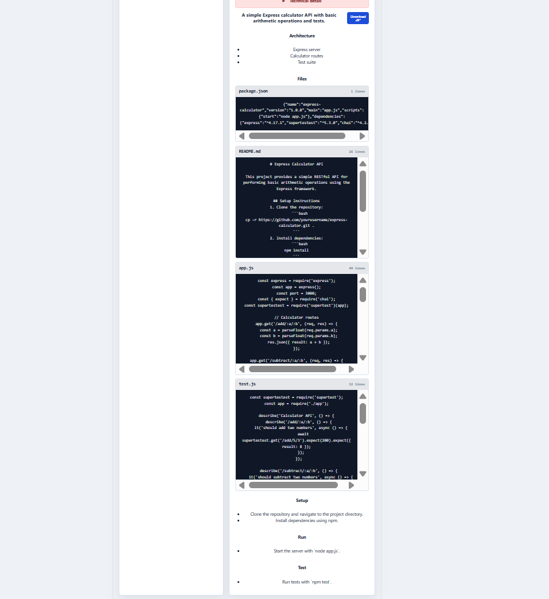
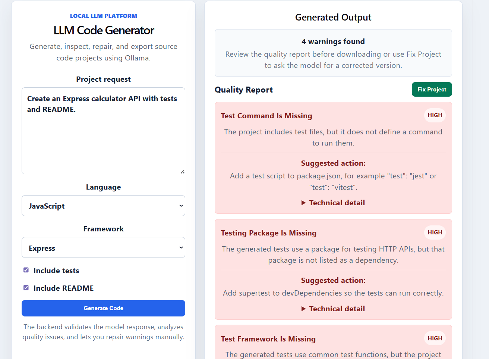
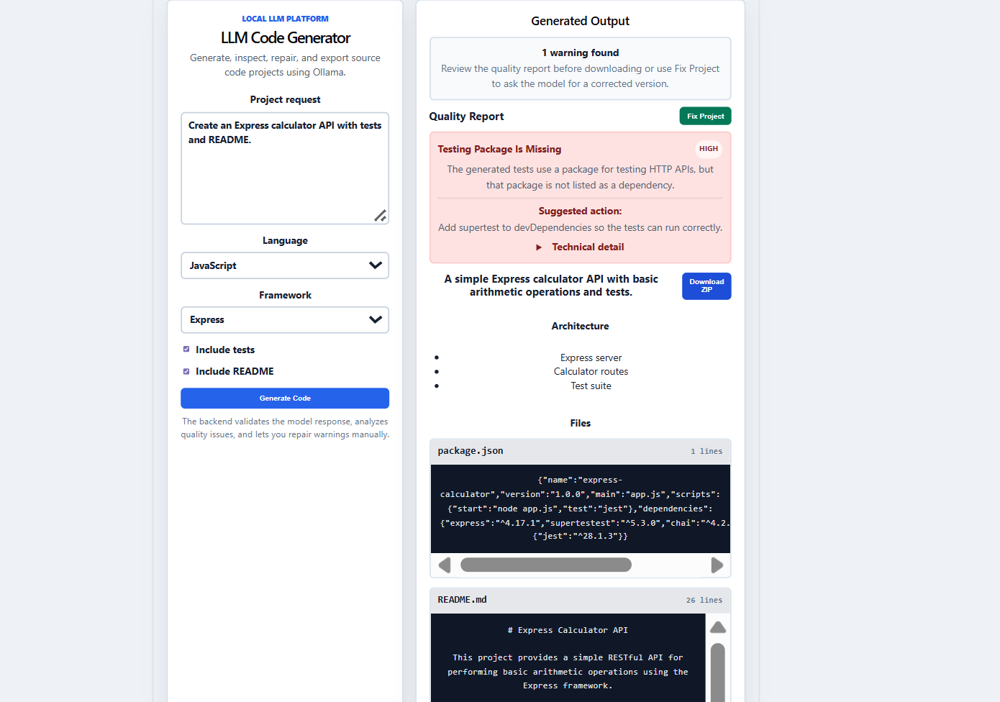

# Génération automatique de code source avec un modèle LLM

Plateforme web académique permettant de générer automatiquement des projets de code source à partir d'une description en langage naturel, en utilisant un modèle LLM local via Ollama.

## Objectif du projet

Ce projet vise à concevoir et développer une application capable de transformer une demande utilisateur en langage naturel en un projet logiciel structuré.

L'objectif n'est pas seulement de générer du texte avec un LLM, mais de construire une plateforme plus complète qui applique plusieurs étapes professionnelles :

- construction d'un prompt structuré ;
- génération du projet avec un modèle LLM local ;
- validation de la réponse générée ;
- analyse de la qualité du projet ;
- affichage d'un rapport qualité compréhensible ;
- correction manuelle des problèmes détectés ;
- export du projet généré sous forme d'archive ZIP.

## Fonctionnalités principales

- Interface web moderne avec React
- Backend avec Node.js et Express.js
- Intégration d'un modèle LLM local avec Ollama
- Utilisation du modèle `qwen2.5-coder:3b`
- Génération de projets à partir d'une description en langage naturel
- Choix du langage, du framework, des tests et du README
- Génération structurée sous forme de fichiers
- Validation du format généré avec Zod
- Analyse statique simple du projet généré
- Rapport qualité lisible par l'utilisateur
- Bouton de correction manuelle avec le LLM
- Export du projet généré en fichier ZIP

## Architecture générale

```text
Frontend React
  -> Backend Express
  -> Prompt Builder
  -> Ollama Provider
  -> Modèle LLM local
  -> JSON Parser
  -> Schema Validation
  -> Quality Analyzer
  -> Manual Fix Loop
  -> ZIP Export
```

## Technologies utilisées

- React
- Vite
- Node.js
- Express.js
- Ollama
- qwen2.5-coder:3b
- Zod
- Archiver
- HTML
- CSS
- JavaScript

## Captures d'écran

### Interface principale



### Projet généré



### Rapport qualité



### Projet corrigé



## Prérequis

Avant d'exécuter le projet, il faut installer :

- Node.js
- npm
- Ollama

Vérifier l'installation d'Ollama :

```bash
ollama --version
```

Installer le modèle LLM utilisé dans le projet :

```bash
ollama pull qwen2.5-coder:3b
```

Vérifier que le modèle est bien installé :

```bash
ollama list
```

## Installation du projet

Cloner le dépôt :

```bash
git clone LIEN_DU_REPO_ICI
cd NOM_DU_REPO
```

Installer les dépendances du backend :

```bash
cd server
npm install
```

Créer le fichier `.env` à partir de l'exemple :

```bash
copy .env.example .env
```

Installer les dépendances du frontend :

```bash
cd ../client
npm install
```

## Configuration

Le backend utilise le fichier suivant :

```text
server/.env
```

Exemple de configuration :

```env
PORT=3001
OLLAMA_BASE_URL=http://localhost:11434
OLLAMA_MODEL=qwen2.5-coder:3b
```

## Exécution

Lancer le backend dans un premier terminal :

```bash
cd server
npm run dev
```

Le backend sera disponible sur :

```text
http://localhost:3001
```

Lancer le frontend dans un deuxième terminal :

```bash
cd client
npm run dev
```

Le frontend sera disponible sur :

```text
http://localhost:5173
```

## Exemple d'utilisation

Exemple de demande utilisateur :

```text
Create an Express calculator API with tests and README.
```

L'application génère ensuite :

- un résumé du projet ;
- une proposition d'architecture ;
- les fichiers source ;
- les instructions d'installation ;
- les instructions d'exécution ;
- les instructions de test ;
- un rapport qualité ;
- une possibilité de correction manuelle ;
- un fichier ZIP téléchargeable.

## Méthodologie

Le système suit une approche en plusieurs étapes.

1. L'utilisateur saisit une demande en langage naturel.
2. Le backend construit un prompt structuré.
3. Le prompt est envoyé au modèle local via Ollama.
4. Le modèle retourne un projet sous forme de JSON.
5. Le backend parse et valide la structure générée.
6. Le système analyse la qualité du projet généré.
7. L'interface affiche les fichiers et le rapport qualité.
8. L'utilisateur peut demander une correction manuelle.
9. Le projet final peut être téléchargé sous forme de ZIP.

Cette méthodologie permet d'éviter une simple utilisation brute du LLM. Le système ajoute une couche de contrôle, de validation et d'amélioration.

## Analyse qualité

Le projet contient un analyseur simple permettant de détecter certains problèmes fréquents dans les projets générés :

- absence de fichier README ;
- absence de fichiers de test ;
- absence de script de test ;
- dépendances de test manquantes ;
- fichier `package.json` invalide ;
- fichier vide ;
- chemin de fichier dangereux ;
- instructions d'installation ou d'exécution manquantes ;
- incohérences entre les tests et le code généré.

Les avertissements sont affichés sous forme d'un rapport lisible par l'utilisateur, avec :

- un titre clair ;
- une explication simple ;
- une suggestion d'action ;
- un détail technique optionnel.

## Correction manuelle

Lorsque le rapport qualité détecte des problèmes, l'utilisateur peut cliquer sur le bouton de correction.

Le système envoie alors au modèle :

- le projet généré ;
- les avertissements détectés ;
- une instruction de réparation.

Le modèle retourne ensuite une version corrigée du projet. Cette version est validée et analysée de nouveau.

Ce choix permet de montrer clairement le processus de génération, d'analyse et d'amélioration du code.

## Export ZIP

Après génération ou correction, l'utilisateur peut télécharger le projet sous forme d'archive ZIP.

Le fichier ZIP contient les fichiers générés par le modèle, par exemple :

```text
package.json
app.js
README.md
test.js
```

Cette fonctionnalité rend le résultat directement exploitable.

## Limites du projet

Le projet présente certaines limites :

- le modèle local peut parfois générer du code incomplet ;
- l'analyse qualité est statique et ne remplace pas l'exécution réelle des tests ;
- les performances dépendent des ressources de la machine ;
- le modèle utilisé est léger afin de fonctionner localement ;
- le système est conçu pour une démonstration académique, pas pour une utilisation en production.

## Améliorations possibles

Plusieurs améliorations peuvent être ajoutées dans une version future :

- exécution automatique des tests dans un environnement isolé ;
- support de plusieurs fournisseurs LLM ;
- ajout de GitHub Models comme fournisseur alternatif ;
- utilisation d'une sandbox Docker ;
- comparaison entre plusieurs modèles ;
- support avancé de plusieurs langages ;
- génération automatique de documentation technique ;
- analyse de sécurité plus avancée.

## Structure du projet

```text
.
├── client
│   ├── src
│   ├── package.json
│   └── index.html
├── server
│   ├── src
│   │   ├── providers
│   │   ├── services
│   │   └── index.js
│   ├── .env.example
│   └── package.json
├── docs
│   └── screenshots
│       ├── 01-home.png
│       ├── 02-generated-project.png
│       ├── 03-quality-report.png
│       └── 04-fixed-project.png
├── README.md
└── .gitignore
```

## Commandes utiles

Lancer le backend :

```bash
cd server
npm run dev
```

Lancer le frontend :

```bash
cd client
npm run dev
```

Installer le modèle Ollama :

```bash
ollama pull qwen2.5-coder:3b
```

Afficher les modèles installés :

```bash
ollama list
```

## Auteure

Sara Souissi, 2eme année SETP, May 2026
```